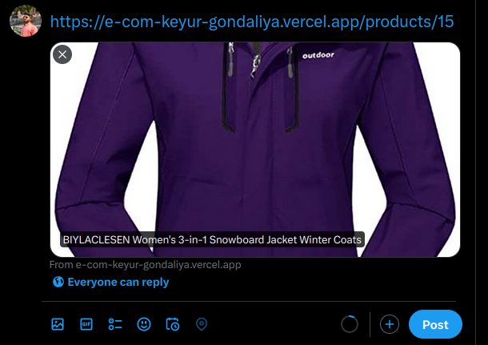
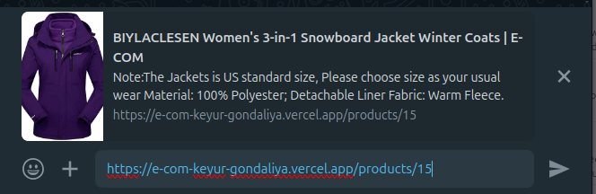

# E-COM

E-COM is E-commerce platform for UAE build with Next14 powered SEO.

# Dynamic URL SEO Demo

## Twitter

## whatsapp

# Project Setup

## Requirements

Dependencies installed:

    Node.js (>=22.x)

## Getting Started

### 1. Clone the Repository

    git clone https://github.com/Keyur-Gondaliya/E-Com.git

### 2. Install Dependencies

    $ npm install

### 4. Run

Go to the root and run

    $ npm run dev

### 5. Ruuning Urls

    Frontend : http://localhost:3000/

# Contributing

We welcome contributions to Codedamn-lite! Feel free to submit bug reports, feature requests, or pull requests through GitHub.

# License

This project is licensed under the MIT License.

#### **_ Feel free to customize the README further based on your project's specific details and requirements. Let me know if you need any further assistance! _**